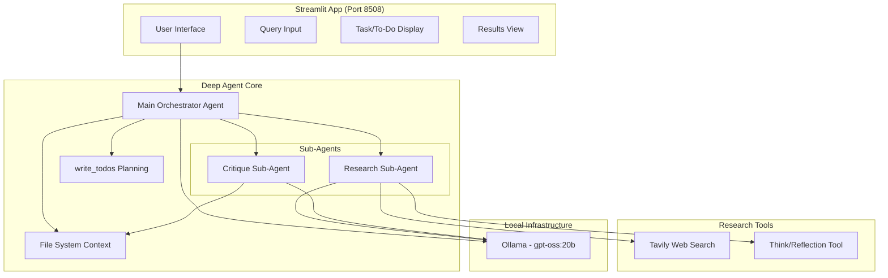

# Implementation Plan: DeepAgents Local Deep Researcher

## Goal

Build a fully local deep researcher using LangChain's deepagents framework with `gpt-oss:20b` from Ollama, featuring a Streamlit web interface for user interaction. The implementation strictly follows the [deepagents-quickstarts/deep_research](https://github.com/langchain-ai/deepagents-quickstarts/tree/main/deep_research) reference while adapting for local LLM usage.

---

## User Review Required

> [!IMPORTANT]
> **LLM Model Choice**: The SPEC specifies `gpt-oss:20b` from Ollama. Please confirm this model is available locally via `ollama list`. If not available, suggest an alternative local model.

> [!WARNING]  
> **Breaking Change for Future Iterations**: This initial implementation focuses on web search only. Vector database integration (as mentioned in SPEC for future scope) will require structural changes to the tools module.

---

## Architecture Overview



---

## Proposed Changes

### Component 1: Project Structure (`/showroom`)

All files will be created in the `/showroom` folder as per SPEC requirements.

```
deepagents_ollama/
├── showroom/
│   ├── __init__.py
│   ├── pyproject.toml
│   ├── .env
│   ├── app.py                    # Streamlit GUI
│   ├── agent.py                  # Main deep agent configuration
│   └── research_agent/
│       ├── __init__.py
│       ├── prompts.py            # All prompt templates
│       └── tools.py              # Tavily search + think tool
```

---

#### [NEW] [pyproject.toml](file:///Users/tobiashein/dev/ai/langgraph/deepagents_ollama/showroom/pyproject.toml)

Project configuration with dependencies:
- `deepagents` - Core framework for deep agents
- `langchain`, `langchain-community`, `langchain-core` - LangChain ecosystem
- `langchain-ollama` - Ollama integration
- `streamlit` - Web GUI framework
- `tavily-python` - Web search capability
- `httpx`, `markdownify` - For fetching and converting web content

---

#### [NEW] [.env](file:///Users/tobiashein/dev/ai/langgraph/deepagents_ollama/showroom/.env)

Environment variables configuration:
- `TAVILY_API_KEY` - For web search (copy from existing `.env`)
- `OLLAMA_MODEL` - Model name (`gpt-oss:20b`)
- `MAX_CONCURRENT_RESEARCH_UNITS` - Parallel sub-agent limit (default: 3)
- `MAX_RESEARCHER_ITERATIONS` - Loop prevention (default: 3)

---

### Component 2: Research Agent Module

#### [NEW] [prompts.py](file:///Users/tobiashein/dev/ai/langgraph/deepagents_ollama/showroom/research_agent/prompts.py)

Prompt templates adapted from the reference implementation:

1. **RESEARCH_WORKFLOW_INSTRUCTIONS** - Main orchestrator workflow:
   - Plan with `write_todos`
   - Save request to `/research_request.md`
   - Delegate to sub-agents
   - Write final report to `/final_report.md`

2. **RESEARCHER_INSTRUCTIONS** - Research sub-agent prompt:
   - Tool usage guidelines (tavily_search, think_tool)
   - Hard limits (2-5 search calls maximum)
   - Citation format instructions

3. **SUBAGENT_DELEGATION_INSTRUCTIONS** - Delegation strategy:
   - Default: 1 sub-agent for simple queries
   - Parallelize only for explicit comparisons
   - Max concurrent units limit

4. **CRITIQUE_PROMPT** - Critique sub-agent:
   - Read from `/final_report.md`
   - Verify against `/research_request.md`

---

#### [NEW] [tools.py](file:///Users/tobiashein/dev/ai/langgraph/deepagents_ollama/showroom/research_agent/tools.py)

Two core tools following the reference implementation:

1. **`tavily_search`** - Web search tool:
   - Uses TavilyClient for URL discovery
   - Fetches full webpage content via httpx
   - Converts HTML to markdown for LLM consumption
   - Parameters: query, max_results, topic

2. **`think_tool`** - Reflection tool:
   - Strategic pause for research quality
   - Records reflection in research workflow
   - Used after each search for gap analysis

---

#### [NEW] [agent.py](file:///Users/tobiashein/dev/ai/langgraph/deepagents_ollama/showroom/agent.py)

Main agent configuration using `create_deep_agent`:

```python
from deepagents import create_deep_agent
from langchain_ollama import ChatOllama

# Configure local Ollama model
model = ChatOllama(model="gpt-oss:20b", temperature=0.0)

# Research sub-agent definition
research_sub_agent = {
    "name": "research-agent",
    "description": "Delegate research to the sub-agent researcher...",
    "system_prompt": RESEARCHER_INSTRUCTIONS.format(date=current_date),
    "tools": [tavily_search, think_tool],
}

# Critique sub-agent definition  
critique_sub_agent = {
    "name": "critique-agent",
    "description": "Critique the final report...",
    "system_prompt": CRITIQUE_PROMPT,
    "tools": [],  # Inherits file system tools
}

# Create the deep agent with recursion limit
agent = create_deep_agent(
    model=model,
    tools=[tavily_search, think_tool],
    system_prompt=INSTRUCTIONS,
    subagents=[research_sub_agent, critique_sub_agent],
    recursion_limit=1000,
)
```

---

### Component 3: Streamlit GUI

#### [NEW] [app.py](file:///Users/tobiashein/dev/ai/langgraph/deepagents_ollama/showroom/app.py)

Streamlit application with:

1. **Page Configuration**:
   - Title: "Deep Researcher v0.1"
   - Port: 8508
   - Wide layout

2. **Sidebar**:
   - Model info display
   - Max iterations setting
   - Debug state toggle

3. **Main Interface Phases**:

   **Phase 1 - Query Input**:
   - Chat input for research question
   - Submit button

   **Phase 2 - Research Execution**:
   - Real-time task/to-do list display
   - Current step indicator
   - Previous step history
   - Sub-agent activity visualization
   - Progress status

   **Phase 3 - Results Display**:
   - Final report markdown rendering
   - Source citations
   - Download button
   - New research button

4. **Quality Safeguards**:
   - Max attempts counter display
   - Warning banner if max iterations reached
   - Reflection/quality check indicators

---

## Verification Plan

### Automated Tests

Since there are no existing tests in `deepagents_ollama/`, we will create verification scripts:

#### Test 1: Ollama Connectivity
```bash
cd /Users/tobiashein/dev/ai/langgraph/deepagents_ollama/showroom
uv run python -c "
from langchain_ollama import ChatOllama
model = ChatOllama(model='gpt-oss:20b')
response = model.invoke('Hello, are you working?')
print('SUCCESS:', response.content[:100])
"
```

#### Test 2: Tavily Search Tool
```bash
cd /Users/tobiashein/dev/ai/langgraph/deepagents_ollama/showroom
uv run python -c "
from research_agent.tools import tavily_search
result = tavily_search.invoke({'query': 'What is LangGraph?'})
print('SUCCESS: Got', len(result), 'characters')
"
```

#### Test 3: Deep Agent Creation
```bash
cd /Users/tobiashein/dev/ai/langgraph/deepagents_ollama/showroom
uv run python -c "
from agent import agent
print('SUCCESS: Agent created with', len(agent.tools), 'tools')
"
```

### Manual Verification

#### Step 1: Start the Streamlit App
```bash
cd /Users/tobiashein/dev/ai/langgraph/deepagents_ollama/showroom
uv run streamlit run app.py --server.port 8508
```

#### Step 2: Test Research Flow
1. Open browser to `http://localhost:8508`
2. Enter query: "What is LangGraph?"
3. **Verify**: To-do list appears and shows task progress
4. **Verify**: Current step and previous steps are displayed
5. **Verify**: Sub-agent spawning is visible
6. Wait for completion (may take 2-5 minutes with local LLM)

#### Step 3: Verify Quality Checks
1. Check that reflection/critique sub-agent was invoked
2. **Verify**: If max iterations reached, warning is displayed
3. **Verify**: Final report includes citations

#### Step 4: Test Results
1. Confirm final report renders correctly
2. Test download button
3. Test "New Research" reset

---

## Implementation Sequence

| Step | Component | Description |
|------|-----------|-------------|
| 1 | Setup | Create `/showroom` folder and `pyproject.toml` |
| 2 | Config | Create `.env` with Tavily API key |
| 3 | Tools | Implement `research_agent/tools.py` |
| 4 | Prompts | Implement `research_agent/prompts.py` |
| 5 | Agent | Implement `agent.py` with Ollama |
| 6 | GUI | Implement `app.py` Streamlit interface |
| 7 | Test | Run verification tests |
| 8 | Docs | Create README.md |

---

## Open Questions for User

1. **Ollama Model**: Is `gpt-oss:20b` correct and available? Should I verify with `ollama list`?

2. **Port Confirmation**: Streamlit will run on port 8508 as specified. Any conflicts?

3. **Tavily API Key**: Should I copy from the existing `.env` file (`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`)?

4. **Recursion Limit**: The reference uses 1000. Is this acceptable for local LLM performance?
